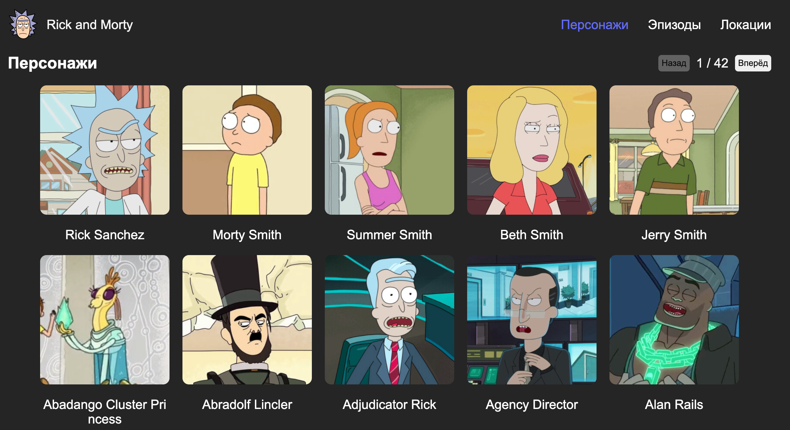

### Web Application по вселенной Rick And Morty

Веб-приложение, отображающее информацию о персонажах,
эпизодах и локациях из мультсериала "Rick and Morty" с
использованием Rest API.

### Функционал
Прототип включает в себя вывод списка персонажей: при наведении на персонажа появляется модальное окна с
краткой информацией, по клику на персонажа открывается страница с подробной информацией. Есть страница со списком эпизодов, по клику открывается страница с подробной информацией об эпизоде. Страница с локациями, по клику на локацию открывается страница с подробной информацией.

### Технологии: 
React, typescript, vite, module scss, docker, axios

#### Запуск dev-сервера (http://localhost:5173)

#### Скачайте архив проекта или склонируйте репозиторий

```sh
git@github.com:lkhusnullina/ram.git
```
#### Установите зависимости проекта

```sh
npm install
```
#### Запустите проект командой

```sh
npm run dev
```

#### Запуск через Docker (http://localhost:3000)

#### Cборка образа

```sh
docker build -t ram .
```

#### Запуск контейнера

```sh
docker run -dp 3000:3000 ram
```

Видеообзор https://disk.yandex.ru/i/hgN2S3cqiWk8mQ
